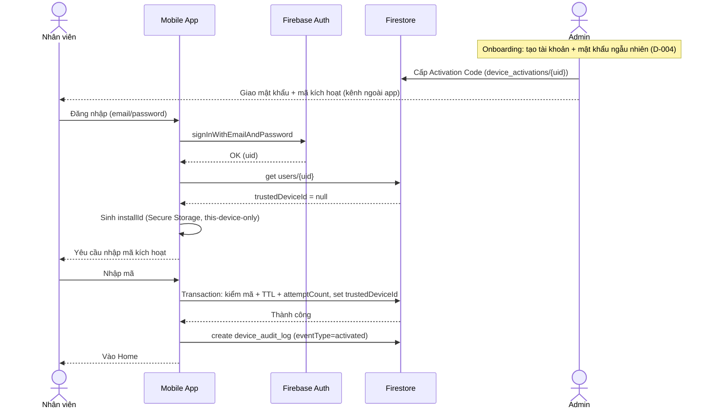
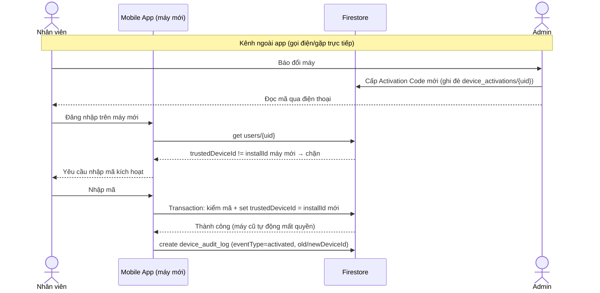
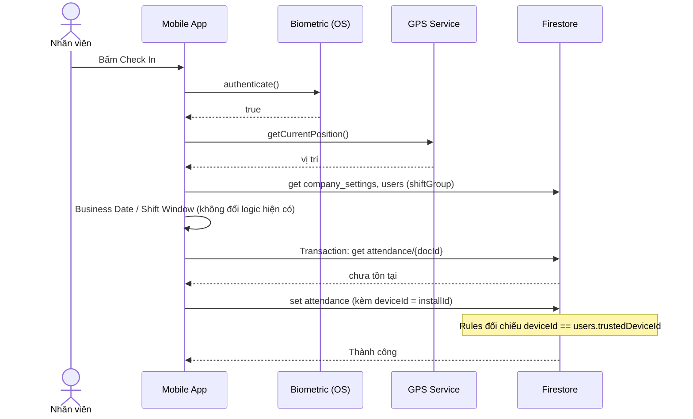
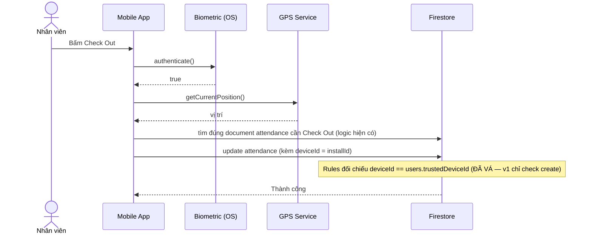
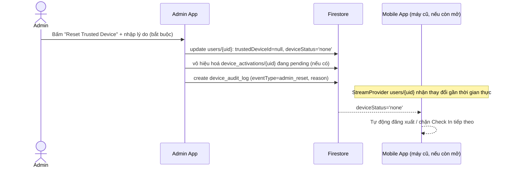
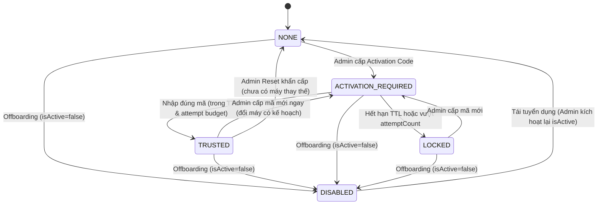

# ANTI_FRAUD_DESIGN.md

**Tài liệu thiết kế chính thức (bản cuối) — FEAT-05: Anti Fraud & Device Security**

**Mục tiêu:** Chống gian lận chấm công (mượn máy, dùng chung tài khoản nhiều thiết bị, đăng nhập trái phép). Tài liệu **phân tích + thiết kế** — không phải task backlog.

**Phạm vi:** Chỉ phân tích và thiết kế. Không sửa code, không cài package, không đổi Firestore Rules thật, không tạo Backlog/Sprint thật trong tài liệu này.

---

## 0. Thay đổi so với bản v2

Bản này là kết quả rà soát dưới góc nhìn Software Architecture / Enterprise Security / Mobile Security / Firebase / Firestore Rules / HRM thực tế / UX / Maintainability / Scalability. **5 thay đổi thực chất:**

1. **Device Identity**: làm rõ `installId` là **Installation Identity**, không phải Device Identity thật — phát hiện thêm rủi ro chưa có ở v2: dữ liệu Secure Storage có thể bị **nhân bản qua cloud backup/restore** nếu không cấu hình loại trừ backup tường minh. Xem §2.
2. **Activation Code**: v2 mới dừng ở "6 số, TTL 30 phút, dùng 1 lần" — **chưa có cơ chế chống brute-force**. Bổ sung đầy đủ: entropy, rate limiting (`attemptCount`), TTL rút xuống 15 phút, quy trình sinh mã mới. Xem §4.
3. **Activation History**: đánh giá và **kết luận không tạo collection mới** — trùng vai trò với Audit Log, tạo thêm sẽ vi phạm nguyên tắc 1-nguồn-sự-thật (bài học từ D-007). Xem §6.
4. **5 chương hoàn toàn mới**: Threat Model (§11), Risk Matrix (§12), Sequence Diagram (§13), State Machine (§14), ER Diagram (§15).
5. **Roadmap nâng cấp**: mỗi Sprint có đầy đủ Goal/Deliverable/Estimate/Dependency/Risk/Definition of Done/Milestone. Xem §17.

---

## 1. Bối cảnh & ràng buộc kế thừa

*(Không đổi từ v1/v2 — xem `docs/decision/01_DECISION_LOG.md`.)*

- **D-006** — không dùng Cloud Functions.
- **D-008** — không đổi kiến trúc (`domain/data/presentation`, không thêm interface Repository).
- **D-007** — không tách package Dart dùng chung; field/collection mới đồng bộ thủ công 2 app.
- **D-009** — công cụ dev/demo dùng `kDebugMode`.
- **CLAUDE.md** — chỉ **thêm** field/collection Firestore; package mới cần xác nhận riêng.

**5 hành vi cần chặn:** (1) mượn máy người khác chấm công, (2) đăng nhập 1 tài khoản nhiều thiết bị, (3) đăng nhập vào thiết bị khác không được phép, (4) người khác mở app thay chủ, (5) chấm công hộ nói chung.

---

## 2. Device Identity — `installId` có thực sự là Device Identity?

### 2.1 Câu trả lời ngắn gọn: **Không hoàn toàn — đây là Installation Identity, không phải Device Identity**

`installId` (UUID tự sinh, lưu Secure Storage) gắn với **vòng đời của 1 lần cài đặt app**, không gắn tuyệt đối với **phần cứng vật lý**. Sự khác biệt này quan trọng và **không đối xứng giữa 2 nền tảng**:

| | Android | iOS |
|---|---|---|
| Hành vi khi gỡ cài + cài lại app | Dữ liệu Secure Storage (EncryptedSharedPreferences/Keystore-backed) **bị xoá cùng dữ liệu riêng của app** → `installId` **mất, sinh lại mới** | Keychain **mặc định giữ nguyên qua gỡ cài/cài lại** (trừ khi thiết bị bị "Erase All Content" hoặc dev chủ động xoá Keychain) → `installId` **có thể sống sót** |
| Kết luận | Đúng nghĩa "Installation Identity" (đổi theo lần cài) | Gần với "Device Identity" hơn (đổi theo máy, không theo lần cài) |

**Đây là 1 điểm bất nhất quán thật giữa 2 nền tảng** — cùng 1 khái niệm `trustedDeviceId` nhưng ngữ nghĩa "khi nào coi là đổi thiết bị" khác nhau tuỳ Android/iOS. Tài liệu này **chấp nhận** sự bất nhất quán này thay vì cố gắng san bằng nó (san bằng đòi hỏi build native phức tạp hơn, không tương xứng lợi ích ở quy mô đồ án) — nhưng **phải gọi đúng tên** khái niệm để không gây hiểu lầm khi đọc code/tài liệu sau này: gọi là **Installation Identity dùng làm đại diện thực dụng cho Device Identity**, không phải Device Identity thật.

### 2.2 So sánh 4 lựa chọn

| Lựa chọn | Có phải Device Identity thật không? | Ổn định | Khó giả mạo (máy chưa root) | Dùng để enforce được không |
|---|---|---|---|---|
| **Android ID / IDFV** | Gần đúng nhất về mặt khái niệm (do OS quản lý, gắn máy+app-signing-key+user) | Trung bình (đổi khi factory reset, đổi signing key, multi-profile — xem v2 §2.1) | Thấp — sửa được dễ dàng trên máy root | Không nên dùng đơn lẻ |
| **Device Fingerprint** (hash gộp model/OS/độ phân giải...) | Không — các thuộc tính này **không unique-per-máy**, nhiều máy cùng model/OS có giá trị giống hệt | Cao (ít đổi) nhưng vì lý do sai (không unique, không phải vì bền vững) | Rất thấp — mọi giá trị đều đọc được và giả lập được dễ dàng | Không |
| **Installation ID** (`installId`, thiết kế hiện tại) | Không — là Installation Identity, xem §2.1 | Cao trên iOS, Trung bình trên Android (mất khi gỡ cài) | Cao — sinh ngẫu nhiên 128-bit, lưu vùng được OS bảo vệ, không đọc được từ ngoài app trên máy chưa root | **Có** |
| **Multi-signal Device Identity** (kết hợp nhiều tín hiệu + chấm điểm rủi ro thay vì so khớp boolean) | Gần đúng nhất về lý thuyết | Cao (nhiều tín hiệu bù trừ cho nhau) | Cao hơn phương án đơn lẻ | Có, nhưng đòi hỏi logic chấm điểm phức tạp, không phải so khớp `==` đơn giản |

### 2.3 Quyết định: giữ `installId` làm Canonical ID, không chuyển sang Multi-signal Scoring

**Không đề xuất kiến trúc Multi-signal Device Identity (chấm điểm rủi ro)** dù về lý thuyết mạnh hơn — vì: (a) đòi hỏi logic so khớp mờ (fuzzy matching/ngưỡng điểm) thay vì so sánh `==` đơn giản trong Firestore Rules, làm tăng đáng kể độ phức tạp và rủi ro viết sai rule (khó kiểm chứng, khó giải trình lúc bảo vệ đồ án); (b) các SDK chống gian lận thương mại dùng multi-signal vì đối tượng tấn công của họ là quy mô lớn, ẩn danh (gian lận quảng cáo, tạo tài khoản hàng loạt) — không khớp bối cảnh 1 công ty nhỏ với danh tính nhân viên đã biết rõ. **Giữ nguyên `installId` làm Canonical ID duy nhất dùng để enforce**, nhưng nâng cấp 2 điểm:

1. **Đổi vai trò của Android ID/IDFV**: từ "chỉ hiển thị, không dùng gì" (v2) → **tín hiệu phụ trợ cho phán đoán của con người**. Khi Admin xem yêu cầu cấp Activation Code hoặc xem Audit Log, hệ thống hiển thị kèm Android ID/IDFV + model máy của lần kích hoạt gần nhất so với lần hiện tại — nếu các giá trị này đổi bất thường (ví dụ Android ID giống hệt nhưng model máy báo khác — dấu hiệu có thể bị giả mạo tinh vi), đó là gợi ý để Admin **hỏi kỹ hơn qua điện thoại** trước khi cấp mã, không phải điều kiện chặn tự động. Tận dụng thêm giá trị từ dữ liệu vốn đã thu thập, không tăng thêm độ phức tạp Rules.
2. **Khắc phục rủi ro mới phát hiện — nhân bản qua cloud backup**: nếu Secure Storage không được cấu hình tường minh loại trừ khỏi cơ chế backup (Android `allowBackup`/Auto Backup, iOS iCloud/iTunes encrypted backup), việc khôi phục backup sang **máy thứ 2** có thể copy nguyên `installId` sang máy đó — 2 máy vật lý khác nhau cùng mang 1 `installId`, phá vỡ tính "duy nhất theo cài đặt". **Bắt buộc cấu hình** (ghi vào task Sprint A, §17): Android loại trừ tường minh key lưu `installId` khỏi Auto Backup; iOS đặt thuộc tính Keychain `kSecAttrAccessibleWhenUnlockedThisDeviceOnly` (loại trừ khỏi iCloud/iTunes backup). Đây là điểm kỹ thuật cụ thể cần xác minh bằng test tay (khôi phục backup thử nghiệm) trước khi coi Sprint A hoàn thành.

**Package cần thêm (không đổi so với v2):** `device_info_plus`, `local_auth`, `flutter_secure_storage`.

---

## 3. Trusted Device — Nghiệp vụ đăng ký thiết bị

*(Kết luận không đổi so với v2 — tóm tắt lại, không lặp lại toàn bộ bảng so sánh 5 phương án đã có.)*

Đã so sánh 5 phương án (Tự động tin lần đầu / Admin duyệt trong app / **Activation Code** / QR Code / Email link) — chọn **Activation Code**: đạt mức an toàn tương đương "Admin duyệt" (có xác thực ngoài-băng-tần thật qua điện thoại/gặp trực tiếp) nhưng chi phí vận hành thấp như "tự động tin" (gộp vào đúng thời điểm Admin đã phải giao mật khẩu ngẫu nhiên D-004 cho nhân viên mới). Dùng thống nhất cho cả đăng ký lần đầu và đổi thiết bị — không còn hàng đợi duyệt riêng trong app.

---

## 4. Activation Code — Đặc tả chi tiết

### 4.1 Entropy & độ dài

- **6 chữ số** = 10⁶ = 1.000.000 tổ hợp ≈ **19,9 bit entropy** — khớp chuẩn phổ biến của OTP ngân hàng/TOTP (Google Authenticator cũng dùng 6 số), đã được kiểm chứng là mức cân bằng hợp lý giữa an toàn và khả năng con người đọc/gõ chính xác qua điện thoại.
- So sánh: 4 số (10⁴ = 10.000) — quá yếu, có thể đoán hết trong vài nghìn lần thử nếu không rate-limit. 8 số — tăng an toàn không đáng kể so với 6 số (khi đã có TTL + rate limiting bù đắp, xem §4.3) nhưng khó đọc/nhớ hơn khi giao tiếp qua điện thoại, không tương xứng. **Giữ 6 số.**

### 4.2 TTL (Time-to-live)

**Điều chỉnh so với v2: rút từ 30 phút xuống 15 phút.** Lý do: thời gian thực tế cần (1 cuộc gọi ngắn + gõ 6 số) dưới 2 phút trong tình huống bình thường; 15 phút vẫn đủ dư dả cho các tình huống chậm trễ hợp lý (đang di chuyển, tín hiệu kém), trong khi giảm gần một nửa cửa sổ thời gian có thể bị khai thác nếu mã bị lộ. Nếu nhân viên không kịp trong 15 phút, Admin chỉ cần cấp lại — thao tác 1 click, chi phí gần như bằng 0 (xem §4.5).

### 4.3 Brute Force & Rate Limiting *(thiếu hoàn toàn ở v2 — bổ sung mới)*

**Vấn đề:** nếu không giới hạn số lần thử, 1.000.000 tổ hợp không phải rào cản với 1 script gọi lặp lại request ghi Firestore trong 15 phút.

**Thiết kế:** thêm field `attemptCount` vào `device_activations/{uid}`. Nguyên tắc bắt buộc: **mọi lần thử redeem (dù đúng hay sai) đều phải là 1 giao dịch làm tăng `attemptCount` thêm đúng 1 — kể cả lần cấp quyền thành công cũng phải đi kèm bước tăng này trong CÙNG 1 lượt ghi.** Nhờ vậy, "ngân sách đoán mã" bị tiêu hao bởi **mọi** lần thử, không phụ thuộc client có trung thực báo cáo kết quả hay không — vì bản thân việc tăng `attemptCount` là điều kiện bắt buộc của **bất kỳ** lượt ghi nào được chấp nhận trên document này, không phải 1 bước tách rời mà client có thể bỏ qua.

- **Ngưỡng đề xuất:** 5 lần thử sai → khoá mã ngay lập tức (chuyển `status = 'locked'`), không đợi hết TTL.
- **Xác suất thành công lý thuyết của brute-force trong vòng đời 1 mã:** 5 / 1.000.000 = **0,0005%** — đủ thấp cho quy mô đồ án, không cần thêm cơ chế phức tạp hơn (ví dụ CAPTCHA, độ trễ luỹ tiến giữa các lần thử) vốn không tương xứng chi phí dev với lợi ích tăng thêm ở mức rủi ro đã rất thấp.

### 4.4 Replay Attack

- **Replay sau khi đã dùng:** mã được đánh dấu `used = true` **atomic cùng lúc** với việc cấp `trustedDeviceId` (Firestore transaction, tái dùng đúng pattern đã có ở `checkIn()` — TD-01). Một request replay y hệt gửi lại sau đó sẽ thấy `used = true` và bị từ chối. Đây là lý do thứ 2 (ngoài chống race condition) để bắt buộc dùng transaction ở bước redeem — làm rõ hơn so với v2 (v2 mới chỉ nêu lý do race condition).
- **Race để giành quyền redeem trước nạn nhân thật** (ví dụ ai đó nghe lỏm mã qua cuộc gọi rồi cố redeem trước): kịch bản này **vẫn cần kẻ tấn công có phiên đăng nhập hợp lệ của đúng tài khoản nạn nhân** (redeem chỉ tác động đúng `device_activations/{uid}` của uid đang đăng nhập) — tức kẻ tấn công phải có **cả** mật khẩu **lẫn** mã kích hoạt trong cùng cửa sổ 15 phút. Đây là lớp phòng thủ kép tự nhiên của thiết kế (không phải cơ chế bổ sung riêng) — nêu rõ để làm minh bạch mức độ bảo vệ thực tế, không phóng đại.

### 4.5 Redeem nhiều lần / Hết hạn / Sinh mã mới

- **Redeem nhiều lần** (dùng đi dùng lại 1 mã đã thành công): bị chặn bởi `used = true` như trên — không có nhu cầu nghiệp vụ hợp lệ nào cần dùng lại 1 mã đã kích hoạt thành công.
- **Hết hạn:** kiểm tra `now < expiresAt` là điều kiện bắt buộc **độc lập** với `attemptCount` trên mọi lượt ghi được chấp nhận — hết hạn thì bị từ chối dù còn "ngân sách" số lần thử.
- **Sinh mã mới:** khi Admin cấp lại (mã cũ hết hạn, bị khoá do brute-force, hoặc nhân viên đổi máy lần nữa), **ghi đè toàn bộ** document `device_activations/{uid}`: mã mới, `attemptCount` reset về 0, `expiresAt` mới, `status = 'pending'`. Mã cũ (nếu còn ai giữ) tự động vô hiệu vì giá trị so khớp trong document đã đổi. Mỗi lần cấp (kể cả cấp lại) ghi 1 dòng Audit Log (`eventType = 'code_issued'`, xem §7).

### 4.6 Bảo mật quyền đọc (nhắc lại, quan trọng nhất)

Mã kích hoạt **không được cấp quyền `read`** cho nhân viên qua Rules — chỉ Admin đọc được (phục vụ tra soát). Việc so khớp "mã nhập vào có đúng không" xảy ra hoàn toàn **bên trong điều kiện ghi (`allow update`)** của Rules, không lộ giá trị thật ra ngoài qua bất kỳ `read` nào. Đây là nguyên lý bắt buộc — nếu vi phạm (ví dụ vô tình cấp `read` để "cho tiện debug"), toàn bộ giá trị bảo mật của kênh-ngoài-app sụp đổ (ai chiếm được token đăng nhập cũng tự đọc được mã, không cần gọi điện cho Admin).

---

## 5. Device Change — Nghiệp vụ đầy đủ

*(Không đổi kết luận so với v2 — nhắc gọn, xem State Machine §14 để hiểu rõ hơn các trạng thái chuyển đổi.)*

| Kịch bản | Xử lý |
|---|---|
| Đổi điện thoại (chủ động) | Admin cấp Activation Code mới trực tiếp (không cần Reset trước) → máy cũ tự mất quyền khi mã mới được redeem |
| Mất điện thoại / thiết bị hỏng | Admin **Reset Trusted Device ngay** (§5.1) trước, không đợi máy thay thế → cấp Activation Code sau khi có máy mới |
| Reset thiết bị / gỡ cài lại app (cùng máy vật lý) | Hệ thống tự phát hiện `installId` không khớp → xử lý như "đổi điện thoại" dù thực chất cùng 1 máy — đánh đổi đã chấp nhận ở §2.1 |
| Nhân viên nghỉ việc | Gộp Reset Trusted Device vào **cùng 1 thao tác** với việc set `isActive = false` (offboarding) trong màn Employee hiện có — không tách bước riêng dễ quên |

### 5.1 Reset Trusted Device (Admin)

- 1 nút trong màn Employee Detail (admin) đã có — không cần màn riêng.
- Hiệu lực: `trustedDeviceId = null`, `deviceStatus = 'none'`, đồng thời vô hiệu hoá ngay mọi `device_activations/{uid}` đang pending.
- **Bắt buộc nhập lý do** trước khi xác nhận (ghi vào Audit Log, `eventType = 'admin_reset'`).
- Máy cũ (nếu đang mở) cần phản ứng gần thời gian thực — đề xuất kỹ thuật: theo dõi `users/{uid}` qua `StreamProvider` thay vì đọc 1 lần (ghi chú cho implementation, không đổi luồng nghiệp vụ hiện có).

---

## 6. Activation History — có cần collection riêng không?

**Kết luận: Không cần.** `device_audit_log` (§7) đã đảm nhiệm đúng vai trò của "Activation History" — mọi sự kiện liên quan tới thiết bị (cấp mã, kích hoạt, reset, hết hạn) đều được ghi ở đó với đầy đủ `eventType`, `oldDeviceId`/`newDeviceId`, `timestamp`.

**Lý do không tạo collection riêng:** "Activation History" và "Audit Log" là **cùng 1 dữ liệu nhìn từ 2 góc** — Audit Log là góc bảo mật/kỹ thuật (ai làm gì, khi nào), Activation History là góc trình bày cho HRM (lịch sử thiết bị của 1 nhân viên, dễ đọc). Tạo 2 collection lưu cùng bản chất dữ liệu là **trùng lặp nguồn sự thật** — 2 nơi lưu cùng 1 sự kiện dễ lệch nhau theo thời gian (đúng bài học đã trả giá ở D-007 với việc trùng lặp model/logic giữa 2 app). 

**Đề xuất thay thế (không phải thiết kế dữ liệu mới, chỉ là cách trình bày):** thêm 1 **UI View** ở Admin — lọc `device_audit_log` theo `uid` + `eventType = 'activated'`, hiển thị dạng "lịch sử thiết bị đã dùng" gọn gàng cho mục đích HRM. Đây là việc trình bày (presentation layer), không tạo thêm schema.

---

## 7. Audit Log

*(Không đổi cấu trúc so với v2, chỉ làm rõ thêm §6 ở trên.)*

**Vì sao cần collection riêng:** dữ liệu lịch sử append-only, tăng dần vô hạn — khác `users` (trạng thái hiện tại, mutable). Nhồi vào mảng trong `users` là anti-pattern (giới hạn 1MB/document) — đúng nguyên tắc dự án đã áp dụng nhất quán (`attendance` là 1 doc/ngày, không phải mảng).

**Cấu trúc `device_audit_log/{id}`:**

| Field | Ý nghĩa |
|---|---|
| `uid` | Nhân viên liên quan |
| `eventType` | `'code_issued' \| 'activated' \| 'admin_reset' \| 'code_expired' \| 'code_locked'` (bổ sung `code_locked` so với v2, khớp cơ chế rate-limit mới ở §4.3) |
| `oldDeviceId` / `newDeviceId` | Trước/sau (nullable tuỳ loại sự kiện) |
| `actorUid` / `actorRole` | Ai thực hiện (`'admin' \| 'employee'`) |
| `reason` | Bắt buộc với `admin_reset` |
| `deviceInfo` | Model/OS — chỉ hiển thị/audit, xem §2.3 |
| `timestamp` | |

**Về IP:** giữ nguyên quyết định v2 — **không lưu**. Client mobile không có cách lấy IP công cộng đáng tin cậy (chỉ qua dịch vụ ngoài, dữ liệu vẫn do client tự khai, cùng lớp giới hạn như GPS D-006). IP đáng tin chỉ lấy được phía server — cần Cloud Function, ngoài phạm vi D-006.

**Quyền:** `create` — Admin hoặc chính nhân viên (hành động họ vừa thực hiện). `read` — Admin đọc toàn bộ; nhân viên đọc log của chính mình (minh bạch). `update`/`delete` — luôn `false`.

---

## 8. Firestore Rules — đánh giá lại

### 8.1 Lỗ hổng đã vá từ v1 → v2 (nhắc lại, không lặp phân tích)

v1 chỉ chặn thiết bị ở `attendance.create` (Check In), bỏ sót `attendance.update` (Check Out) — đã sửa ở v2, giữ nguyên ở bản này: điều kiện `deviceId == trustedDeviceId` áp dụng cho **cả create và update**.

### 8.2 Cập nhật theo thiết kế Activation Code mới (§4)

| Thay đổi | Nguyên nhân |
|---|---|
| `device_activations/{uid}`: `allow update` (redeem) chỉ chấp nhận nếu **đồng thời** đúng mã, chưa hết hạn (`now < expiresAt`), **và** `attemptCount` hiện tại chưa đạt ngưỡng (5) — cả 3 điều kiện trên MỌI lượt ghi được chấp nhận, không riêng lượt thành công | Đảm bảo rate limiting thực thi ở tầng Rules, không phụ thuộc client trung thực (§4.3) |
| `device_activations/{uid}`: **không** có `allow read` cho owner (chỉ Admin) | Bảo vệ giá trị "kênh ngoài" của Activation Code (§4.6) |
| `users/{uid}`: owner chỉ được tự ghi `trustedDeviceId`/`deviceStatus` khi kèm điều kiện đối chiếu mã hợp lệ ở `device_activations/{uid}` (qua `get()` cross-document, đúng pattern `currentUserData()` đã có tiền lệ) | Ngăn owner tự ý ghi đè `trustedDeviceId` mà không qua Activation Code |
| `attendance/{docId}`: điều kiện `deviceId == currentUserData().trustedDeviceId` ở cả `create` và `update` | Giữ nguyên từ v2, đã xác nhận đúng |
| `device_audit_log/{id}`: `create` — Admin hoặc chính owner (hành động của họ); `read` — Admin toàn bộ, owner chỉ log của mình; `update`/`delete` — `false` | Theo §7 |

### 8.3 Bypass cần lường trước *(giữ nguyên phân tích v2, đây là phần quan trọng nhất)*

Device Binding qua Rules chặn được **mượn máy thông thường** (app gốc, chưa sửa đổi — `installId` đọc từ máy mượn không khớp → Rules từ chối ngay). Đây là đa số gian lận thực tế ở công ty nhỏ (hành vi xã hội, không phải tấn công kỹ thuật).

**Không chặn được** kẻ tấn công có khả năng kỹ thuật: ai đó có access token hợp lệ (qua máy root/Frida/app bị sửa) có thể tự soạn request Firestore SDK gán `deviceId` bằng giá trị `trustedDeviceId` mà họ đọc được, bỏ qua UI app thật hoàn toàn. Đây **không phải lỗi có thể vá bằng rule chặt hơn** — là giới hạn cấu trúc của hệ thống chỉ dùng Rules + Auth thuần, không có backend độc lập xác thực lại. Phân tích đầy đủ ở §10, định lượng ở §12.

---

## 9. Biometric — 6 điểm chạm

*(Không đổi kết luận so với v2 — bảng đầy đủ giữ nguyên vì phân tích vẫn đúng sau khi rà soát lại.)*

| Điểm chạm | Quyết định | Lý do ngắn gọn |
|---|---|---|
| Mở app | Không dùng | OS đã có khoá màn hình, thêm gate không tăng bảo mật thực chất |
| Mở Home | Không dùng | Trùng thời điểm với vừa xác thực password, dư thừa |
| **Check In** | **Dùng** | Thời điểm nghiệp vụ quan trọng nhất |
| **Check Out** | **Dùng** | Cùng mức quan trọng, tránh bảo vệ nửa vời |
| Đổi thông tin cá nhân | Không cần thêm | `reauthenticate()` bằng password đã tồn tại sẵn, trùng mục đích |
| Đổi thiết bị (nhập Activation Code) | Không cần thêm | Đã có 2 lớp độc lập (password + mã ngoài-băng-tần), biometric ở đây không đối chiếu được với máy cũ, không tăng giá trị |

---

## 10. Security Limitations

*(Không đổi so với v2 — bảng đầy đủ vẫn đúng, chỉ tham chiếu chéo tới §12 Risk Matrix để tránh trùng lặp phân tích.)*

| Kỹ thuật tấn công | Ảnh hưởng | Phân loại |
|---|---|---|
| Root / Magisk | Sửa `installId`, ép `local_auth` trả `true` giả | Ngoài phạm vi đồ án |
| Xposed / Frida / Hook Framework | Hook runtime giả toàn bộ tín hiệu client — lớp tấn công mạnh nhất, xem §8.3 | Không thể giải quyết nếu không có backend riêng |
| Reverse Engineering | Decompile, gọi thẳng Firestore REST API bỏ qua UI | Không thể giải quyết nếu không có backend riêng |
| App Clone | `installId` khác theo sandbox → tự nhiên bị chặn | Đã xử lý bởi thiết kế hiện tại |
| Virtual Device/Emulator | Không phải vector riêng, chỉ thuận lợi hơn cho Root/Hook | Ngoài phạm vi đồ án |
| Thiết bị compromise (malware OS) | Ngoài khả năng kiểm soát của bất kỳ app nào | Ngoài phạm vi đồ án |

**Nhóm cần Cloud Function mới giải quyết được:** xác thực lại độc lập với client mọi giá trị nhạy cảm (deviceId, GPS, biometric) — bị D-006 loại khỏi phạm vi.

**Kết luận:** FEAT-05 nâng "sàn" bảo mật (chặn gian lận thông thường), không nâng "trần" (không chặn tấn công kỹ thuật có chủ đích) — nhất quán với D-006.

---

## 11. Threat Model *(chương mới)*

### 11.1 Assets (tài sản cần bảo vệ)

| Asset | Mức quan trọng |
|---|---|
| Tính toàn vẹn dữ liệu chấm công (`attendance`) — nguồn tính lương | Cao |
| Danh tính thiết bị tin cậy (`trustedDeviceId`) — cổng kiểm soát chính | Cao |
| Activation Code — bí mật ngắn hạn | Trung bình (giá trị giảm nhanh theo TTL) |
| Tài khoản nhân viên (Firebase Auth credential) | Cao |
| Dữ liệu cá nhân nhân viên (`users` — tên/SĐT/email) | Trung bình |

### 11.2 Threat Actors

| Actor | Kỹ năng | Động cơ | Mức ưu tiên phòng thủ |
|---|---|---|---|
| Đồng nghiệp/người quen (mượn máy, biết mật khẩu do chia sẻ không cẩn thận) | Thấp | Tiện lợi, không ác ý nghiêm trọng | **Cao — nhóm chính FEAT-05 nhắm tới** |
| Nhân viên chủ động gian lận (nhờ đồng nghiệp chấm công hộ) | Thấp-Trung bình | Lợi ích cá nhân trực tiếp (lương/KPI) | Cao |
| Người ngoài có quyền truy cập vật lý tạm thời (khách, người nhà) | Thấp | Thường không cố ý | Trung bình |
| Kẻ tấn công kỹ thuật (root/Frida/reverse-engineering) | Cao | Hiếm gặp thực tế với hệ thống nội bộ quy mô nhỏ, không đủ giá trị kinh tế thu hút tấn công có chủ đích | Thấp hơn 3 nhóm trên dù nguy hiểm hơn về lý thuyết — quyết định không đầu tư App Check vào core (§17 Sprint F) phản ánh đúng thứ tự ưu tiên này |

### 11.3 Attack Surface

- App mobile (client code — decompile được).
- Kênh Firestore SDK (network — gọi thẳng ngoài UI được nếu có token hợp lệ).
- Kênh giao tiếp ngoài app khi cấp Activation Code (điện thoại/gặp trực tiếp) — bề mặt **phi kỹ thuật** (social engineering), không phải kỹ thuật.
- Thiết bị vật lý khi đã mở khoá và rời tay chủ.

### 11.4 Existing Controls (tóm tắt, chi tiết ở §12)

Device Binding + Rules enforcement (§8), Biometric tại Check In/Out (§9), Activation Code với rate limiting (§4), Reset khẩn cấp (§5.1).

### 11.5 Residual Risk theo Asset

| Asset | Residual Risk sau kiểm soát | Mức độ |
|---|---|---|
| Tính toàn vẹn `attendance` | Vẫn có thể bị phá vỡ bởi tấn công kỹ thuật (root/hook), không phải bởi mượn máy thông thường | Medium (chấp nhận, ngoài D-006) |
| `trustedDeviceId` | Đọc được bởi chính owner (cần thiết cho UX), nên bị lộ nếu token bị đánh cắp | Medium |
| Activation Code | Rate-limited, TTL ngắn, không đọc được qua Rules | Low |
| Tài khoản nhân viên | Ngoài phạm vi FEAT-05 (thuộc Firebase Auth) | Không đổi so với hiện trạng |

---

## 12. Risk Matrix

**Thang đo:** Likelihood/Impact/Risk Level = Low / Medium / High.

| Threat | Likelihood | Impact | Risk Level | Mitigation | Residual Risk |
|---|---|---|---|---|---|
| **Borrow Phone** (mượn máy đã đăng nhập sẵn) | High | Medium | **High** | Biometric bắt buộc tại Check In/Out (§9) | Low |
| **Credential Sharing** (chia sẻ email/password) | Medium | High | **High** | Device Binding — máy thứ 2 cần Activation Code (§3) | Low |
| **Lost Device** | Low-Medium | Medium | Medium | Reset Trusted Device khẩn cấp (§5.1) | Low (residual = khoảng trễ giữa lúc mất máy và lúc Admin reset) |
| **Root** | Low (không phải chính sách BYOD mở, máy công ty nhỏ) | High | Medium | Không có biện pháp kỹ thuật triệt để trong phạm vi (§10) | Medium-High (chấp nhận, ngoài D-006) |
| **Reverse Engineering** | Low (giá trị mục tiêu thấp — hệ thống nội bộ) | High | Medium | Không có trong core (App Check là Sprint F tuỳ chọn) | Medium |
| **Hook Framework** (Frida/Xposed) | Low | High | Medium | Không có trong core | Medium-High |
| **App Clone** | Low | Low (tự nhiên bị chặn — §2.3) | **Low** | Kiến trúc `installId` theo sandbox | Low |
| **Emulator** | Low | Medium | Low-Medium | Không cần biện pháp riêng — cùng lớp Root/Hook | Medium (gộp theo Root/Hook) |
| **Replay Attack** (Activation Code) | Low | Medium | Low-Medium | Single-use + transaction atomic mark-used (§4.4) | Low |
| **Brute Force** (đoán Activation Code) | Low *(sau khi có rate limit)* | Medium | Low *(trước rate limit: Medium)* | `attemptCount` ≤ 5 trong TTL 15 phút — xác suất lý thuyết ≈ 0,0005%/mã (§4.3) | Low |

---

## 13. Sequence Diagram

### 13.1 First Device Activation



### 13.2 Device Change



### 13.3 Check In



### 13.4 Check Out



### 13.5 Reset Trusted Device



---

## 14. State Machine

**Lưu ý điều chỉnh so với gợi ý ban đầu:** ví dụ gợi ý có liệt kê "RESET" như 1 trạng thái riêng. Trong thiết kế này, **Reset là 1 hành động (transition trigger) do Admin thực hiện, không phải trạng thái persistent** của `deviceStatus` — không có nhân viên nào "đang ở trạng thái Reset" kéo dài theo thời gian. Điều chỉnh để đúng nguyên tắc State Machine (trạng thái là thứ hệ thống "đang ở đó" tại 1 thời điểm; hành động là cái gây ra chuyển trạng thái).

**Các trạng thái (`deviceStatus`):**

| Trạng thái | Ý nghĩa |
|---|---|
| `NONE` | Chưa từng có thiết bị nào được đăng ký |
| `ACTIVATION_REQUIRED` | Có Activation Code đang chờ nhập (`device_activations.status = 'pending'`) |
| `TRUSTED` | `trustedDeviceId` đã set và khớp máy hiện tại — cho phép Check In/Out |
| `LOCKED` | Mã bị khoá do vượt `attemptCount` hoặc hết hạn — chờ Admin cấp mã mới |
| `DISABLED` | Trạng thái tổ hợp = (`deviceStatus` bất kỳ) + `isActive = false` — không phải giá trị enum riêng, chỉ cần ghi nhận rõ ngữ nghĩa khi đọc code |



---

## 15. ER Diagram

```mermaid
erDiagram
    USERS ||--o{ ATTENDANCE : "có nhiều bản ghi"
    USERS ||--o| DEVICE_ACTIVATIONS : "có tối đa 1 mã hiện hành"
    USERS ||--o{ DEVICE_AUDIT_LOG : "có nhiều sự kiện"

    USERS {
        string uid PK
        string trustedDeviceId
        string deviceStatus
        bool isActive
    }
    ATTENDANCE {
        string docId PK "yyyy-MM-dd_uid"
        string uid FK
        string deviceId
        timestamp checkIn
        timestamp checkOut
    }
    DEVICE_ACTIVATIONS {
        string uid PK_FK "doc ID = uid"
        string code
        string newDeviceId
        int attemptCount
        timestamp expiresAt
        string status
    }
    DEVICE_AUDIT_LOG {
        string id PK
        string uid FK
        string eventType
        string actorUid
        timestamp timestamp
    }
```

*(Firestore là NoSQL, không có ràng buộc khoá ngoại thật — sơ đồ trên là biểu diễn logic phục vụ tài liệu, không phải ràng buộc được enforce bởi database.)*

---

## 16. Kiến trúc tổng thể

```
┌─────────────────────────── Mobile (attendance_mobile) ───────────────────────────┐
│                                                                                     │
│  DeviceService (MỚI, core/services/)                                              │
│    - đọc/sinh installId (flutter_secure_storage, cấu hình loại trừ backup — §2.3) │
│    - đọc deviceInfo phụ (device_info_plus) — chỉ hiển thị/audit                   │
│                                                                                     │
│  login_form.dart → AuthRepository.login() → so khớp installId với                 │
│  users.trustedDeviceId                                                            │
│    ├── khớp/chưa có → vào Home bình thường                                        │
│    └── không khớp → màn "Nhập mã kích hoạt thiết bị" (MỚI)                        │
│                        → DeviceActivationRepository (MỚI) → device_activations    │
│                          (transaction: kiểm mã+TTL+attemptCount, TD-01 style)      │
│                                                                                     │
│  checkin_screen.dart / attendance_provider.dart                                   │
│    → BiometricService (MỚI, services/, local_auth)                                │
│      .authenticate() → true → luồng GPS/Business Date hiện có (KHÔNG đổi logic)   │
│                                                                                     │
└─────────────────────────────────────────────────────────────────────────────────┘
                                        │
                                        ▼
┌─────────────────────────────────── Firebase ─────────────────────────────────────┐
│  Firestore:                                                                       │
│    users/{uid}              + trustedDeviceId, deviceStatus                       │
│    device_activations/{uid} MỚI — mã kích hoạt hiện hành (code/attemptCount/TTL)  │
│    device_audit_log/{id}    MỚI — lịch sử append-only                             │
│    attendance/{docId}       + deviceId                                            │
│  Firestore Rules: đối chiếu trustedDeviceId ở CẢ create lẫn update attendance;    │
│    rate-limit + no-read trên device_activations                                  │
│  Firebase Auth: KHÔNG đổi — vẫn signInWithEmailAndPassword thuần                  │
└────────────────────────────────────────────────────────────────────────────────────┘
                                        │
                                        ▼
┌─────────────────────────── Admin (attendance_admin) ──────────────────────────────┐
│                                                                                     │
│  Màn Employee Detail (đã có) + 2 nút mới:                                         │
│    - "Cấp mã kích hoạt thiết bị"                                                  │
│    - "Reset Trusted Device" (khẩn cấp, bắt buộc lý do — §5.1)                     │
│    - Gộp Reset vào nút "Deactivate" hiện có khi offboarding                       │
│  Màn MỚI (nhỏ): xem Audit Log — bảng, lọc theo nhân viên (đóng vai trò            │
│    Activation History, xem §6)                                                    │
│                                                                                     │
└─────────────────────────────────────────────────────────────────────────────────────┘
```

---

## 17. Roadmap theo Sprint (nâng cấp)

### Sprint A — Device Identity & Data Model nền tảng

| | |
|---|---|
| **Goal** | Có định danh thiết bị ổn định + toàn bộ field/collection Firestore mới, chưa enforce gì |
| **Deliverable** | `DeviceService` hoạt động trên Android + iOS; field mới ở `users`; collection `device_activations`/`device_audit_log` tồn tại; `UserModel` đồng bộ 2 app |
| **Task** | `DeviceService` (installId qua `flutter_secure_storage`, **cấu hình loại trừ backup tường minh** — §2.3); `deviceInfo` phụ qua `device_info_plus`; field mới `users`; cập nhật `UserModel` 2 app |
| **Estimate** | ~1.5-2 ngày |
| **Dependency** | none |
| **Risk** | Trung bình — hành vi `installId` khác nhau giữa Android/iOS (§2.1) cần kiểm chứng thật, không chỉ đọc tài liệu |
| **Definition of Done** | `installId` sinh đúng 1 lần/cài đặt trên cả 2 nền tảng; **test tay khôi phục backup xác nhận `installId` KHÔNG bị nhân bản sang máy khác**; field mới hiển thị đúng trên Firestore Console; `UserModel` đối chiếu field-by-field khớp 2 app |
| **Milestone** | Đóng góp vào **F1 — Anti-Fraud Core** (§17 cuối) |

### Sprint B — Activation Code (đăng ký lần đầu + đổi thiết bị hợp nhất)

| | |
|---|---|
| **Goal** | Nghiệp vụ core hoàn chỉnh — Admin cấp mã, nhân viên nhập mã, có rate limiting |
| **Deliverable** | UI Admin "Cấp mã kích hoạt"; UI Mobile "Nhập mã kích hoạt"; `DeviceActivationRepository` (2 app); transaction redemption có `attemptCount`/TTL |
| **Task** | Theo §4 đầy đủ: sinh mã 6 số, TTL 15 phút, `attemptCount` ≤ 5, no-read trên mã, transaction atomic mark-used |
| **Estimate** | ~3-3.5 ngày (tăng nhẹ so với v2 do bổ sung rate-limiting) |
| **Dependency** | Sprint A |
| **Risk** | **Cao** — phần kỹ thuật phức tạp nhất FEAT-05 (transaction + điều kiện Rules cross-document + rate limiting); cần test kỹ race condition, hết hạn giữa chừng, vượt ngưỡng thử |
| **Definition of Done** | Test tay đủ 6 kịch bản: mã đúng trong hạn → trusted; mã sai → tăng đúng `attemptCount`; vượt ngưỡng → khoá (`LOCKED`); hết hạn → từ chối dù còn attempt; redeem 2 lần cùng lúc → chỉ 1 thắng; Admin cấp lại → mã cũ vô hiệu ngay |
| **Milestone** | F1 |

### Sprint C — Firestore Rules Enforcement

| | |
|---|---|
| **Goal** | Bật enforce thật ở tầng Rules cho cả Check In và Check Out |
| **Deliverable** | `firestore.rules` cập nhật theo §8.2, đã deploy và tự kiểm thử bypass |
| **Task** | Cập nhật rule; tự thử bypass qua Firebase Console/REST API để tự xác minh (đáng tin hơn chỉ test qua UI) |
| **Estimate** | ~1 ngày |
| **Dependency** | Sprint A + B **phải ổn định trên toàn bộ nhân viên hiện có trước** |
| **Risk** | **Cao nhất toàn bộ FEAT-05** — nếu bật rule khi còn nhân viên có `trustedDeviceId = null`, họ bị khoá check-in đồng loạt ngay lập tức |
| **Definition of Done** | Query xác nhận 100% nhân viên `isActive = true` đã có `trustedDeviceId` hợp lệ **trước khi** deploy rule; tự thử ghi `attendance` với `deviceId` sai qua Console → bị từ chối, ở cả create và update |
| **Milestone** | F1 |

### Sprint D — Biometric tại Check In/Check Out

| | |
|---|---|
| **Goal** | Thêm lớp xác thực sinh trắc học đúng 2 điểm đã chốt (§9) |
| **Deliverable** | `BiometricService` gọi trước bước GPS trong `checkIn()`/`checkOut()` |
| **Estimate** | ~1 ngày |
| **Dependency** | none — độc lập hoàn toàn, làm song song bất kỳ lúc nào |
| **Risk** | Thấp |
| **Definition of Done** | Biometric thành công là điều kiện bắt buộc trước khi luồng tiếp tục; fallback PIN/pattern hoạt động đúng trên máy không có cảm biến vân tay/khuôn mặt |
| **Milestone** | F1 |

### Sprint E — Admin: Quản lý thiết bị & Reset khẩn cấp & Audit Log

| | |
|---|---|
| **Goal** | Công cụ vận hành cho Admin — Reset, xem Audit Log, tích hợp offboarding |
| **Deliverable** | Nút "Reset Trusted Device" trong màn Employee; gộp vào flow Deactivate; màn Audit Log (đóng vai trò Activation History — §6) |
| **Estimate** | ~1.5-2 ngày |
| **Dependency** | Sprint A, B |
| **Risk** | Thấp — UI bổ sung vào màn có sẵn |
| **Definition of Done** | Reset yêu cầu lý do bắt buộc mới cho phép xác nhận; test tay deactivate 1 nhân viên → xác nhận `trustedDeviceId` về `null` cùng lúc; Audit Log lọc đúng theo nhân viên |
| **Milestone** | **F1 hoàn tất — Anti-Fraud Core Complete** |

### Sprint F — Firebase App Check *(Tuỳ chọn, ngoài core)*

| | |
|---|---|
| **Goal** | Hardening bổ sung cho lớp tấn công kỹ thuật (§10/§12 — Reverse Engineering/Hook Framework) |
| **Deliverable** | App Check tích hợp, bật chế độ enforce trên Firebase Console |
| **Estimate** | ~1-2 ngày |
| **Dependency** | none |
| **Risk** | Trung bình — phụ thuộc cấu hình Google Play Console, ngoài kiểm soát thuần code; rủi ro khoá nhầm bản build hợp lệ nếu bật enforce vội |
| **Definition of Done** | Bật ở chế độ "monitor only" trước, xác nhận không khoá nhầm client hợp lệ hiện có, rồi mới chuyển "enforce" |
| **Milestone** | **F2 — Anti-Fraud Hardening (tuỳ chọn, không bắt buộc cho đồ án)** |

**Tổng ước lượng core (A→E):** ~8-9,5 ngày công.
**Thứ tự:** A → D (song song được với B) → B → C → E → F (tuỳ chọn, bất kỳ lúc nào).

---

## 18. Đánh giá tính khả thi

| Tiêu chí | Đánh giá |
|---|---|
| Phù hợp đồ án tốt nghiệp | Cao — Threat Model/Risk Matrix/State Machine/ER Diagram nâng tài liệu lên gần chuẩn SDD doanh nghiệp mà vẫn nằm trong khả năng triển khai 1 sinh viên |
| Độ khó triển khai | Trung bình-Cao, tập trung Sprint B/C. Không vượt kỹ thuật đã dùng trong dự án (transaction: TD-01; `get()`-trong-Rules: D-003) |
| Rủi ro | Lớn nhất là **vận hành** (rollout Sprint C sai thứ tự) — đã có kế hoạch giảm thiểu rõ (DoD yêu cầu query xác nhận trước khi deploy) |
| Ảnh hưởng kiến trúc | Thấp — không đổi layer, không đổi Auth flow, chỉ thêm field/collection |
| Ảnh hưởng Firebase | Tăng nhẹ read quota (1 `get()` thêm mỗi Check In/Out); 2 collection nhỏ, tăng chậm |
| Ảnh hưởng UX | 2 điểm chạm mới (biometric, ~1-2 giây); độ trễ khi đổi thiết bị là chủ đích, khớp thực tế HRM nhỏ |
| Ảnh hưởng Performance | Không đáng kể |

---

## 19. Kết luận — Kiến trúc cuối cùng

**Thành phần cốt lõi (Sprint A→E):**
- Trusted Device = Installation Identity (`installId`, Secure Storage, cấu hình loại trừ backup) + Android ID/IDFV chỉ làm tín hiệu phụ trợ cho Admin.
- Activation Code (6 số, TTL 15 phút, rate-limit 5 lần, single-use, không cấp quyền đọc) — cơ chế duy nhất cho cả đăng ký lần đầu và đổi thiết bị.
- Biometric bắt buộc tại đúng Check In/Check Out.
- Rules enforce ở **cả** Check In và Check Out.
- Audit Log riêng biệt — kiêm vai trò Activation History, không tạo dữ liệu trùng lặp.
- Reset Trusted Device (Admin) — tích hợp cả khẩn cấp lẫn offboarding.

**Thành phần bị loại bỏ có chủ đích (không tương xứng chi phí/lợi ích ở quy mô đồ án):**
- Multi-signal Device Identity (chấm điểm rủi ro thay vì so khớp boolean).
- Hàng đợi duyệt thiết bị trong app (thay bằng Activation Code).
- Biometric ở 4/6 điểm chạm còn lại.
- Collection Activation History riêng (trùng Audit Log).
- Firebase App Check trong core (đẩy sang Sprint F tuỳ chọn — đúng thứ tự ưu tiên theo Threat Model §11.2: kẻ tấn công kỹ thuật là nhóm ít ưu tiên nhất ở quy mô công ty nhỏ).

**Giới hạn cuối cùng cần nêu khi bảo vệ:** FEAT-05 chặn được gian lận **thông thường** (đúng 5 hành vi yêu cầu ban đầu), không chặn được tấn công **kỹ thuật có chủ đích** (root/hook/reverse-engineering, định lượng ở §12) — mức đó cần backend riêng + Cloud Functions, ngoài phạm vi cam kết từ D-006.

---

**Việc cần bạn xác nhận trước khi chuyển sang Backlog/Sprint thật:**
1. Đồng ý cơ chế Activation Code với thông số cụ thể: 6 số, TTL 15 phút, rate-limit 5 lần (§4).
2. Đồng ý phạm vi core = Sprint A→E, hoãn Sprint F (App Check) sang tuỳ chọn.
3. Xác nhận 3 package trước khi cài: `device_info_plus`, `local_auth`, `flutter_secure_storage` (bao gồm yêu cầu cấu hình loại trừ backup — §2.3, cần lưu ý thêm lúc cấu hình native Android/iOS, không chỉ thêm dependency Dart).
4. Đồng ý gộp Reset Trusted Device vào nút Deactivate nhân viên hiện có (§5, kịch bản nghỉ việc).
5. Đồng ý không tạo collection Activation History riêng (§6) — dùng UI View lọc trên Audit Log.

Chờ bạn xác nhận — **không code, không cài package, không tạo Backlog/Sprint cho tới khi có xác nhận.**
